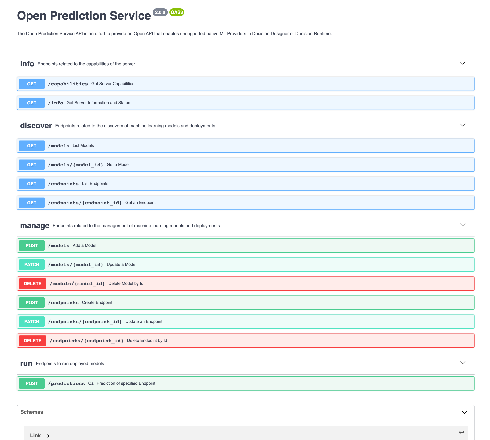
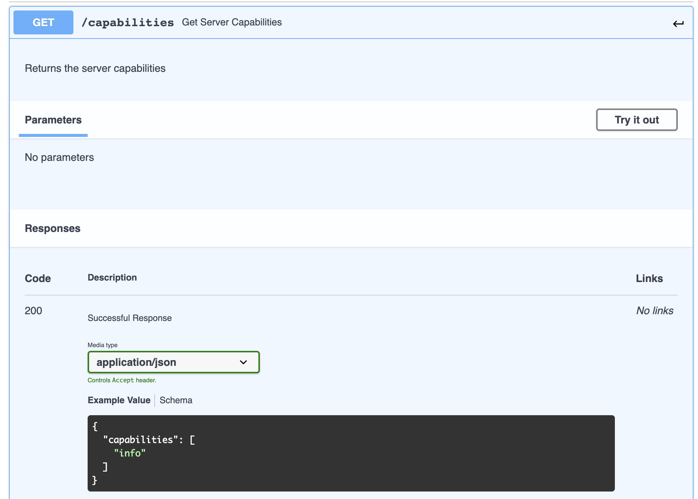
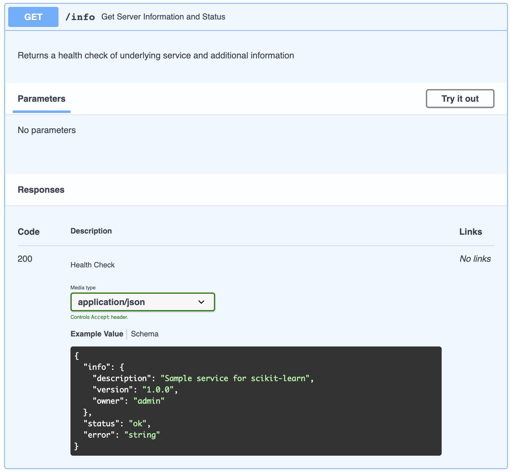
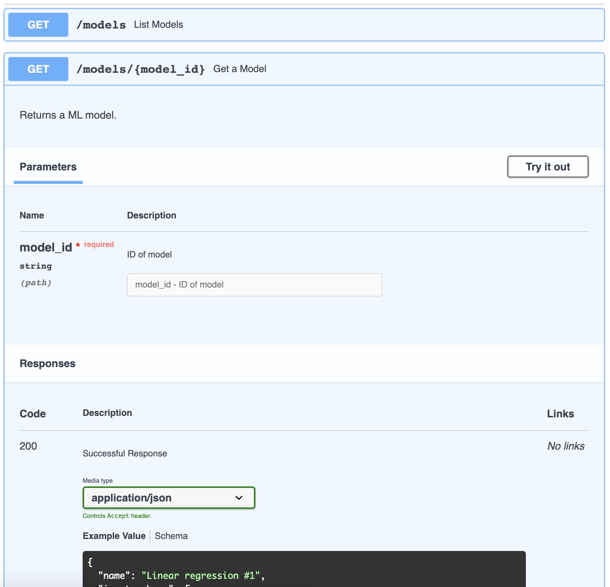
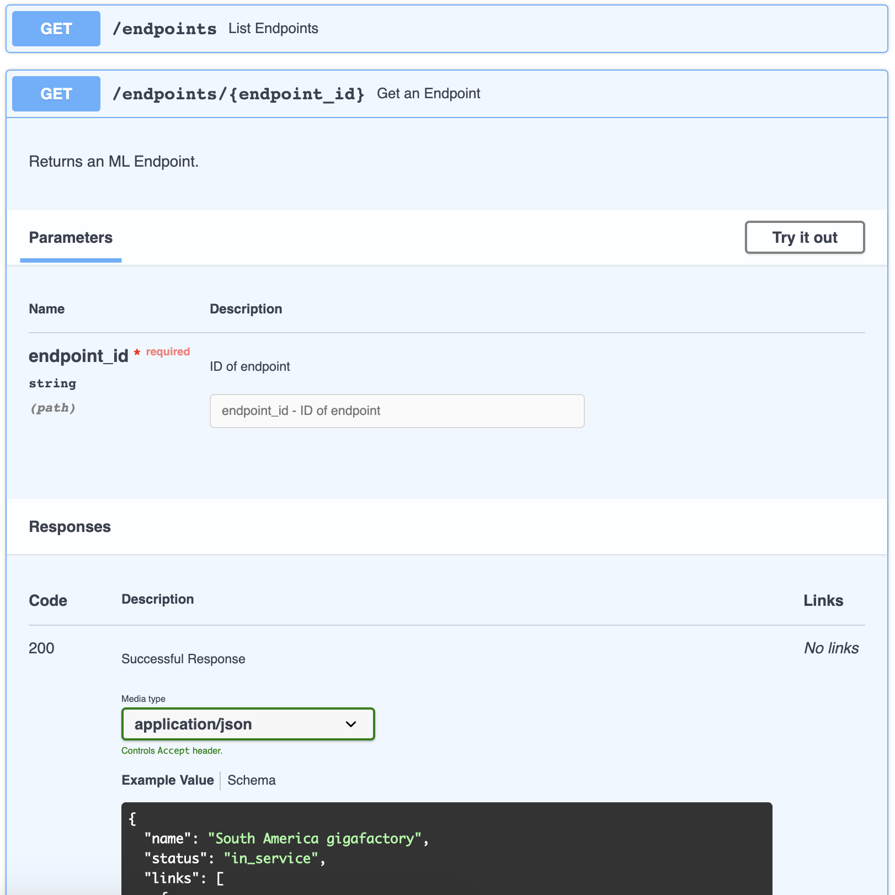
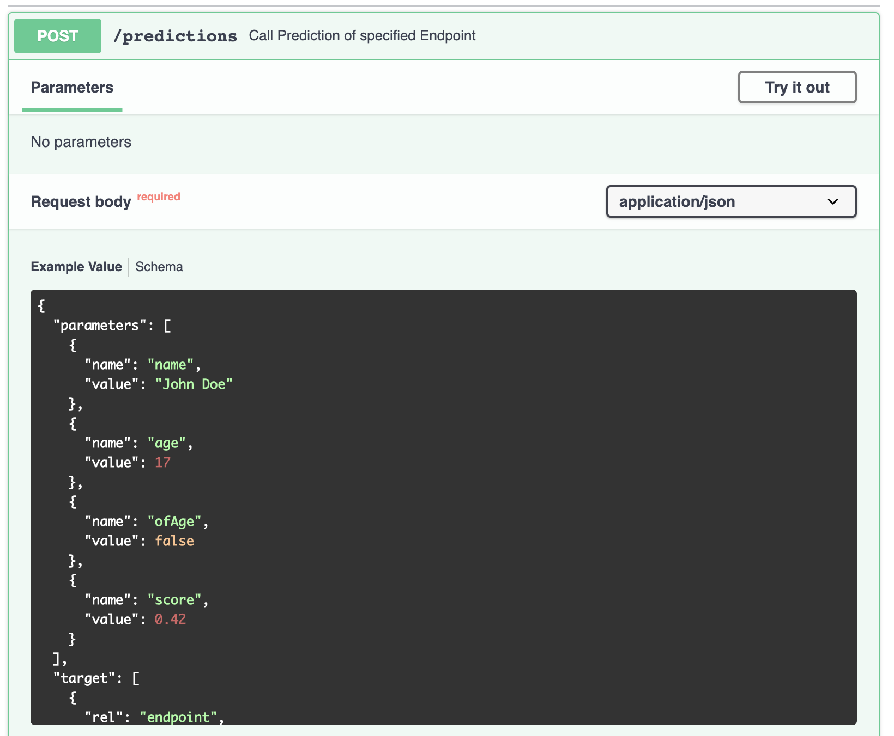
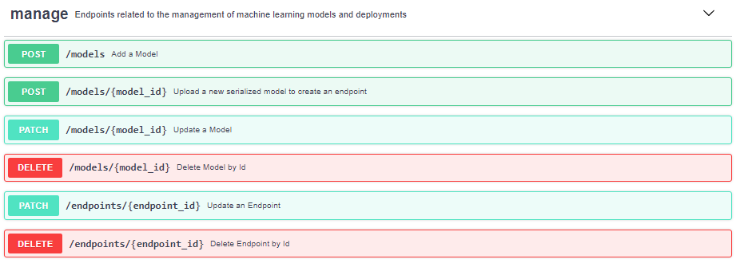
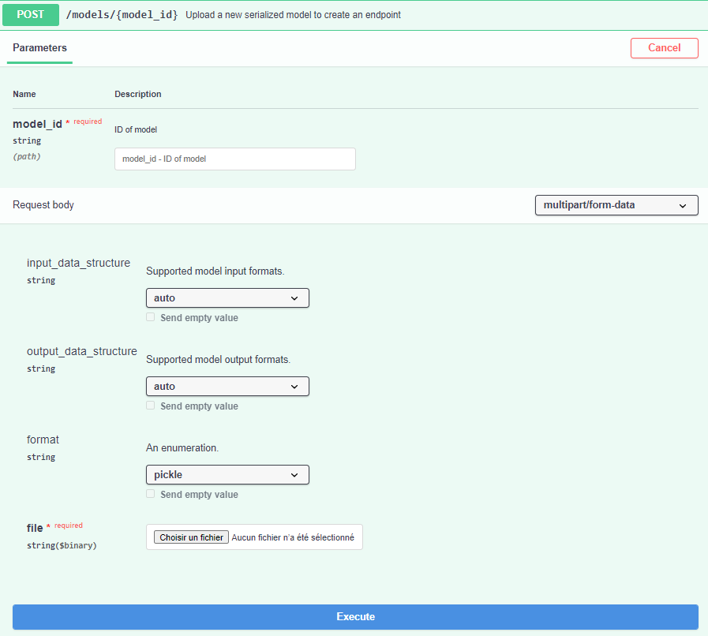

# Open Prediction Service

The Open Prediction Service API is an effort to provide an OpenAPI that enables unsupported native ML Providers in Decision Designer or Decision Runtime.

Thanks to this service, as any third party ML tools can be integrated to match the API specifications, third party ML tools can be reached out the same way for ML model discovery and invocation in Decision Designer or Decision Runtime.
The Open Prediction Service API is suitable for both ML proxy service and custom ML service which provides a lot of flexibility and different level support.


In this repository we provide only the Open Prediction Service OpenAPI specification.

You can head to our [Open Prediction Service Hub](https://github.com/IBM/open-prediction-service-hub) Open Source repository that has many python implementations using [scikit-learn](https://scikit-learn.org/) and [XGBoost](https://xgboost.ai/) but also proxies to [IBM Watson Machine Learning](https://www.ibm.com/cloud/machine-learning) or [Amazon SageMaker](https://aws.amazon.com/sagemaker/) for example.

## OpenAPI specification

The Open Prediction Service is available as an [OpenAPI v3 specification](open-prediction-service.yaml). 

Our specification takes the following hypothesis into account. We manipulate **Models** and **Endpoints**.

**Model**: represents a trained Machine Learning Model that has an (optional) input and output contract. A **Model** can have one or many **Endpoints**. 

**Endpoint**: represents the deployment of a **Model** and is the entry point to execute the prediction carried by the **Model**

**Input Schema**: This is a part of the **Model** information that will provide consumers of the service the necessary information to construct the payload to call the prediction endpoint.

**Output Schema**: This is a part of the **Model** information that will provide consumers of the service the necessary information to understand the response fron the prediction endpoint.

This specification has four main sections. These sections also represent the capabilities an implementation of this OpenApi is able to provide:

- **info** section for getting server information and capabilities.
- **discover** for the discovery of models and related endpoints.
- **manage** for adding, altering or deleting models and endpoints (optional).
- **run** for model prediction invocation

All the types manipulated by the different endpoints are described in the **Schemas** section of the OpenApi.



### *info* section

#### `/capabilities` `GET`



This endpoint can be used to get a list of supported operations
(any subset of `{info, discover, manage, run}`) of the service.

if `manage` is one of the supported capabilities the answer might
contain an entry listing the supported input and output internal
structures as well as the supported binary model formats like in
this example response:

```json
{
  "capabilities": [
    "info",
    "discover",
    "manage",
    "run"
  ],
  "manage_capabilities": {
    "supported_input_data_structure" : [ "auto", "DataFrame", "ndarray", "DMatrix", "list"],
    "supported_output_data_structure" : [ "auto", "DataFrame", "ndarray", "list"],
    "supported_format" : [ "pickle", "joblib", "pmml", "bst" ]
  }
}
```

#### `/info` `GET`



This endpoint can be used to test the availability of the service. 
It returns runtime information.

### *discover* section

This section is used to retrieve model & endpoint information. 

* `/models[/{model_id}]` `GET`
* `/endpoints[/{endpoint_id}]` `GET`




Those endpoints will return the selected resources. Model is the
input/output signature of predictive model and Endpoint is the "binary model".
A predictive model is the combination of a model and an endpoint.

### *run* section

#### `/predictions` `POST`



This endpoint serves all prediction requests. 
Each invocation needs to contain endpoint information and model inputs that represented as key-value pairs.

### *manage* section

The section `manage` is not mandatory for OPS compatible implementations. It 
is designed to facilitate the usage of non-proxy OPS implementations.

This section allows model & endpoint to be created, altered, deleted at the runtime. 


#### `/models` `POST`
##### parameters

This endpoint lets you add a new model to the service.
Calling it requires a request body with the following parameter
* **name** (string): name of the model
* **input_schema** (optional array \<Features>): an array of Feature describing the input schema of model. Each Feature represents one of the parameters of the input schema. A Feature is an object with three required parameters: name (string), order (integer), type (string).
* **output_schema** (optional array \<Features>): an array of Feature describing the output schema of model. Each Feature represents one of the parameters of the output schema. A Feature is an object with three required parameters: name (string), order (integer), type (string).
* **version** (optional string): version of the model.
* **links** (optional array \<Link>): an array of Link describing links related to the object. Each Link is an object made of two parameters: rel (string), href (string).
* **metadata** (optional object): Metadata related to the model, with a description (string) field.


##### response

There are two possible answers to this POST method depending on:
* **successful validation**: The object returns the supplied parameters in the request body and :
    * **id** (string): ID of the model.
    * **created_at** (string): date of the model creation.
    * **modified_at** (string): date of the last model update.
* **failed validation**: returns an object with an error string.

#### `/models/{model_id}` `POST`
##### parameters


This endpoint lets you upload a serialized model with an existing model [ID](#models-post).
The request body requires 4 parameters:
*  **input_data_structure** (optional string): The model's input data format. Currently supported: 
    * auto: automatically inferred by the backend.
    * DataFrame: [Panda DataFrame](https://pandas.pydata.org/pandas-docs/stable/reference/api/pandas.DataFrame.html)
    * ndarray: [Numpy ndarray](https://numpy.org/doc/stable/reference/generated/numpy.ndarray.html)
    * DMatrix: [xgboost DMatrix](https://xgboost.readthedocs.io/en/latest/python/python_api.html#module-xgboost.core)
    * list: python array.
*  **output_data_structure** (optional string): The model's output data format. Currently supported: 
    * auto: automatically inferred by the backend.
    * DataFrame: [Panda DataFrame](https://pandas.pydata.org/pandas-docs/stable/reference/api/pandas.DataFrame.html)
    * ndarray: [Numpy ndarray](https://numpy.org/doc/stable/reference/generated/numpy.ndarray.html)
    * list: python array.
*  **format** (optional string): The model's serialization protocol. Currently supported: 
    * pickle: [python object serialization](https://docs.python.org/3/library/pickle.html)
    * joblib: [joblib serialization format](https://joblib.readthedocs.io/en/latest/generated/joblib.dump.html)
    * pmml: [Predictive Model Markup Language](http://dmg.org/)
    * bst: [xgboost serialization format](https://xgboost.readthedocs.io/en/latest/python/python_intro.html#training)
*  **file** (binary): The model's file.
##### response

This endpoint has two possible answer depending on:
* **successful validation**: It returns a 201 http reponse with an ENDPOINT object. The 201 answer doesn't guarantee the successful completion of the operation. To check the status of the operation, the ENDPOINT can be queried as described in [GET /endpoints/{endpoint_id}](#discover-section): 
* **failed validation**: returns an object with an error string.
### License
Apache License Version 2.0, January 2004.
