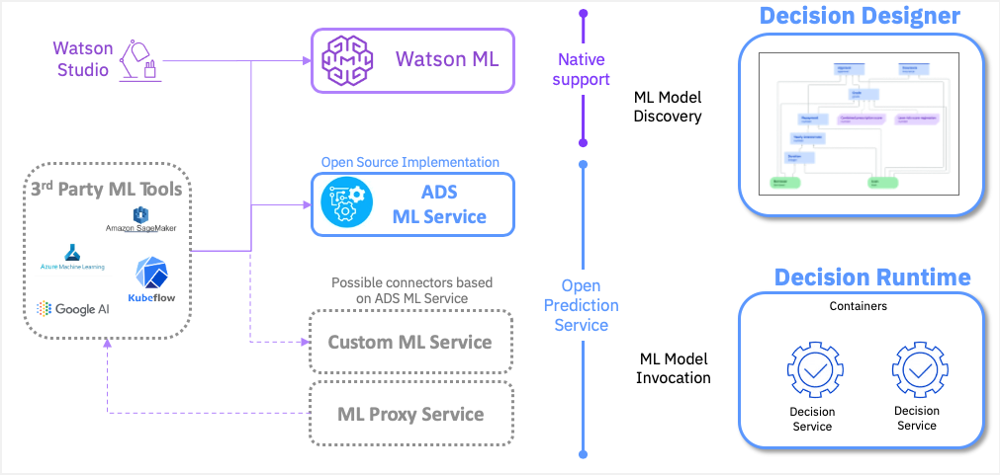

# Open Prediction Service

The Open Prediction Service API is an effort to provide an OpenAPI that enables unsupported native ML Providers in Decision Designer or Decision Runtime.

Thanks to this service, as any third party ML tools can be integrated to match the API specifications, third party ML tools can be reached out the same way for ML model discovery and invocation in Decision Designer or Decision Runtime.
The Open Prediction Service API is suitable for both ML proxy service and custom ML service which provides a lot of flexibility and different level support.

In this repository we provide only the Open Prediction Service OpenAPI specification.

You can head to our [Open Prediction Service Hub](https://github.com/IBM/open-prediction-service-hub) Open Source repository that has many python implementations using [scikit-learn](https://scikit-learn.org/) and [XGBoost](https://xgboost.ai/) but also proxies to [IBM Watson Machine Learning](https://www.ibm.com/cloud/machine-learning) or [Amazon SageMaker](https://aws.amazon.com/sagemaker/) for example.

## OpenAPI specification

The Open Prediction Service is available as an [OpenAPI v3 specification](open-prediction-service.yaml). 

Our specification takes the following hypothesis into account. We manipulate **Models** and **Endpoints**.

**Model**: represents a trained Machine Learning Model that has an (optional) input and output contract. A **Model** can have one or many **Endpoints**. 

**Endpoint**: represents the deployment of a **Model** and is the entry point to execute the prediction carried by the **Model**

**Input Schema**: This is a part of the **Model** information that will provide consumers of the service the necessary information to construct the payload to call the prediction endpoint.

**Output Schema**: This is a part of the **Model** information that will provide consumers of the service the necessary information to understand the response fron the prediction endpoint.

This specification has four main sections. These sections also represent the capabilities an implementation of this OpenApi is able to provide:

- **info** section for getting server information and capabilities.
- **discover** for the discovery of models and related endpoints.
- **manage** for adding, altering or deleting models and endpoints (optional).
- **run** for model prediction invocation

All the types manipulated by the different endpoints are described in the **Schemas** section of the OpenApi.

### *info* section

#### `/capabilities` `GET`

This endpoint can be used to get a list of supported operation 
(any subset of `{info, discover, manage, run}`) of the service.

#### `/info` `GET`

This endpoint can be used to test the availability of the service. 
It returns runtime information.

### *discover* section

This section is used to retrieve model & endpoint information. 

* `/models[/{model_id}]` `GET`
* `/endpoints[/{endpoint_id}]` `GET`

Those endpoints will return the selected resources. Model is the
input/output signature of predictive model and Endpoint is the "binary model".
A predictive model is the combination of a model and an endpoint.

### *run* section

#### `/predictions` `POST`

This endpoint serves all prediction requests. 
Each invocation needs to contain endpoint information and model inputs that represented as key-value pairs.

### *manage* section

The section `manage` is not mandatory for OPS compatible implementations. It 
is designed to facilitate the usage of non-proxy OPS implementations.

This section allows model & endpoint to be created, altered, deleted at the runtime. 

### License
Apache License Version 2.0, January 2004.
